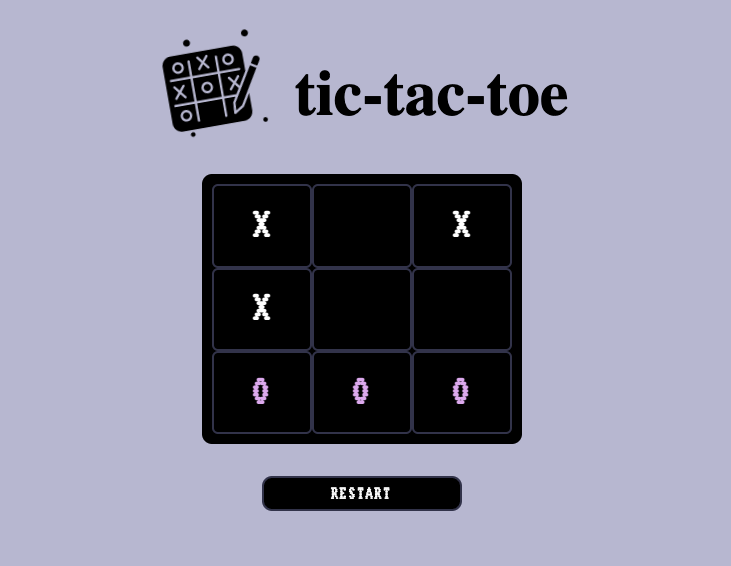

### 1. TIC-TAC-TOE, ou melhor, Jogo da Velha (PT-BR)

   Um exercício, que consiste em um jogo do Tic-Tac-Toe, feito em JavaScript puro, com arquivos HTML e CSS.

   Com o JavaScript Object Literal, foi inicializado o board, contendo 9 casas, onde serão preenchicas com "X" ou "O". Este board é 
criado em tela com a função draw em divs complementadas com o CSS - Grid e Flexbox.

   O estado do jogo é armazenado em um array chamado board e os símbolos em um objeto. O vetor board representa o tabuleiro do jogo, onde 
cada elemento corresponde a uma célula no board. O objeto de símbolos mantém o símbolo do jogador atual correspondente aos índices 0 e 1.

   A função play é onde a mágica acontece. Quando um jogador faz uma jogada, esta função atualiza o estado do jogo e verifica se o jogo 
está encerrado. Se houver um ganhador, ele ilumina os símbolos das células ganhadoras; se o jogo for todo preenchido e não houve 
ganhador, não houve vencedor (gameover); e ainda, caso nenhuma das duas situações sejam alcançadas, dá-se sequência ao jogo, alternando 
o símbolo de acordo com o jogador da vez.

   Para vencer o jogo, a função check_winning_sequences verifica se há uma sequência ganhadora de acordo com as possibilidades de vencer no jogo da velha.

Caso queira começar um novo jogo, basta pressionar o botão para reiniciar o estado do jogo, limpando o board.

### 1. TIC-TAC-TOE (EN)

An exercise involving a Tic-Tac-Toe game implemented in pure JavaScript, utilizing HTML and CSS files.

Using JavaScript Object Literal, the board is initialized, consisting of 9 cells that can be filled with either "X" or "O". This board       is displayed on the screen using the draw function in divs, complemented with CSS - Grid and Flexbox.

The game state is stored in an array named "board", and the symbols are stored in an object. The board array represents the game board,      where each element corresponds to a cell of the board. The symbol object keeps track of the current player's symbol at indices 0 and 1.

The play function is where the magic happens. When a player makes a move, this function updates the game state and checks if the game is 
over. If there's a winner, it sends an alert message to the winner and highlights the symbols of the winning cells. If the entire board      is filled and there's no winner, it indicates the game is over and there are no more moves. If neither of these situations occurs, the   
game continues, switching symbols according to the current player.

To determine a win, the check_winning_sequences function examines whether there is a winning sequence based on the possibility to win 
in Tic-Tac-Toe.

If you want to start a new game, simply press the button to reset the game state, clearing the board.

Best Regards! <3

CinPi7.

