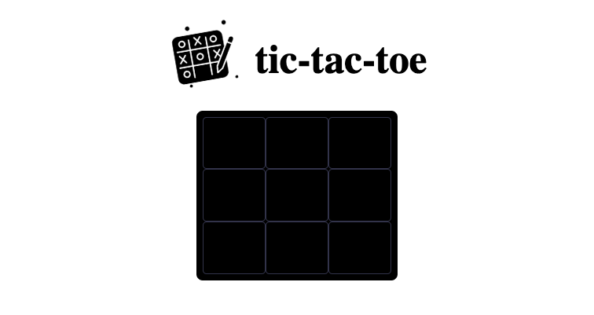

1. TIC-TAC-TOE

Um exercício, que consiste em um jogo do Tic-Tac-Toe, feito em JavaScript puro, com arquivos HTML e CSS.

Com o JavaScript Object Literal, foi inicializado o board, contendo 9 casas, onde serão preenchicas com "X" ou "O":

Este board é desenhado em tela, assim, com a criação do draw em divs complementadas com o CSS - Grid e Flexbox.

